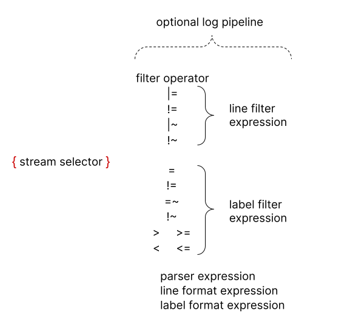
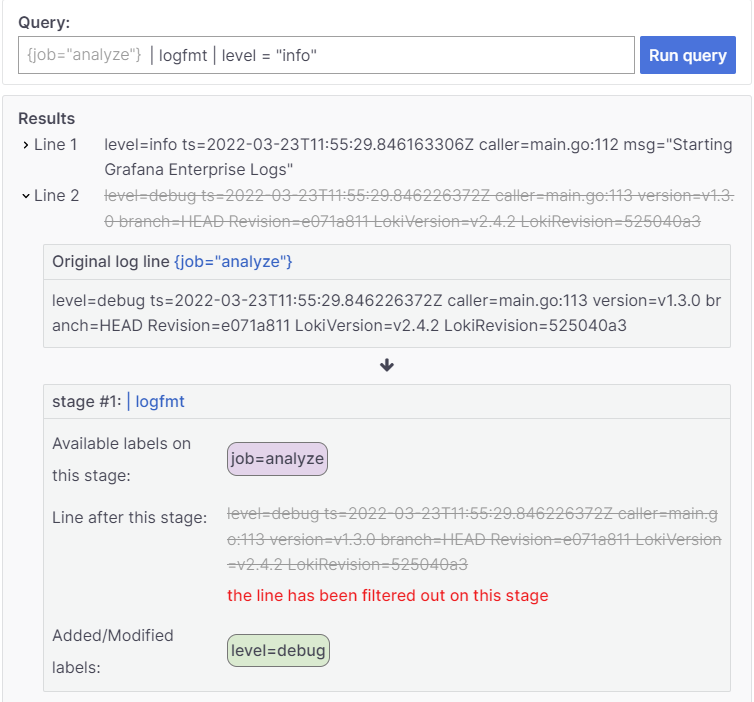
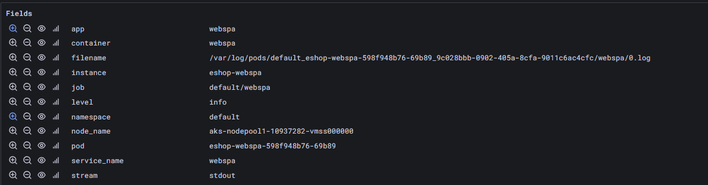
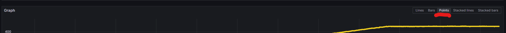
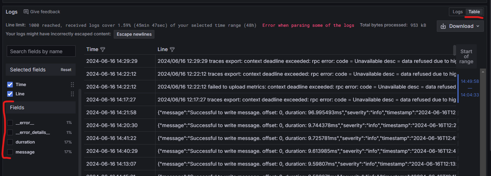
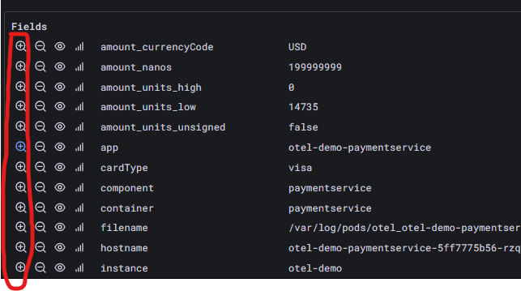
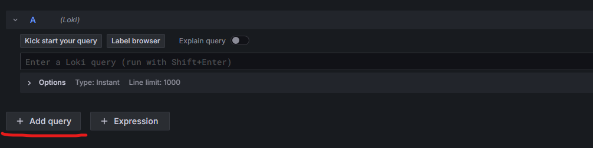

# Składnia Loki
## Budowa składni


## Analizator składni Loki

Grafana wydała [onlinowy analizator składni Loki](https://grafana.com/docs/loki/latest/query/analyzer/) który krok po kroku pokazuje jak przebiega analiza.

## Podstawowe elementy składni LogQL (**L**oki **Q**uery **L**anguage):

### Labele
Służą do filtrowania logów. Są to pary klucz-wartość przypisane do każdego wpisu logu.

> ❗Poniższe przykłady są na **generycznych wartościach**. Aby zadziałały w instancji loki będzięcie musieli zmienić je na stosowne. 
> Nie ma kopiuj, przeklej :)

```logql
{app="my-app"}
```

### Operatory na labelach
- `=` - Dokładne matchowanie logów z labelem

    ```logql
    {app="my-app"}
    ```
- Matchowanie wielu labeli. Poniższe zmatchuje logi z **obydwoma** labelami
    ```
    {app="my-app",name="mysql-backup"}
    ```
- `!=` - Dokładne matchowanie logów **bez** labela

    ```logql
    {app !="my-app"}
    ```

- `=~` Matchowanie logów z labeli przy użyciu [regex](https://github.com/google/re2/wiki/Syntax)

    ```logql
    {app =~".*mysql.*"}
    ```
- `!~` Matchowanie logów **bez** labeli przy użyciem [regex](https://github.com/google/re2/wiki/Syntax)

    ```logql
    {app !~".*mysql.*"}
    ```

## Filtracja
Przetwarzania wybranych logów

### Filtracja tekstu
- `|=` - Wyszukuje logi zawierające określony tekst.

    ```
    {app="web-app"} |= "error"
    ```

- `!=` - Wyszukuje logi **NIE** zawierające określony tekst.

    ```
    {app="web-app"} != "error"
    ```

- `|~` - Wyszukuje logi pasujące do wyrażenia regularnego.

    ```
    {app="web-app"} |~ "er.*"
    ```

- `!~` - Wyszukuje logi **NIE** pasujące do wyrażenia regularnego.

    ```
    {app="web-app"} !~ "er.*"
    ```

### Parsed fields

Loki automatyczne parsuje logi i wyciąga z nich wartości. Są wyświetlane w UI w poniższy sposób:



Pola `app` i `namespace` są labelami i można do nich odwoływać się taką składnią:

```
{namespace="default",app="webspa"} 
```

Pole `level` nie jest labelem i użycie go tak samo jak labela **nie** zadziała:

```
{namespace="default",app="webspa", level="error"} 
```

Natomiast zadziała taka składnia:

```
{namespace="default",app="webspa"} | level="error"
```

# Ćwiczenia

## 1. Wybór strumienia
### 1.1 Wybór po namespace
**🎯Cel:**: Wyszukaj logi z aplikacji znajdujacych się w Kubernetes namespace `otel`.

### 1.2 Podstawowe zapytanie
**🎯Cel**: Wyszukaj logi z aplikacji `otel-demo-adservice` znajdujacych się w Kubernetes namespace `otel`.

### 1.3 Regex
**🎯Cel**: Wyszukaj logi ze wszystkich aplikacji których nazwa kończy się na `service` w namespace `otel`

## 2 Wyszukiwanie w tekście
### 2.1 Wyszukiwanie w tekście
**🎯Cel**: Wyszukaj logi w aplikacjach znajdujacych się w Kubernetes namespace `otel` które mają w treści frazę `error`.

### 2.2 Detected fields (wykryte pola)
> ⚠️Loki stara się automatycznie wykryć niektóre pola. Pola te kiedyś nie różniły się niczym, ale teraz mają przedrostek 'detected_'
**🎯Cel:** Wyszukaj logi w aplikacjach znajdujacych się w Kubernetes namespace `otel` wykryte pole `level` o wartości `error`.

### 2.3 Kolejkowanie wyszukiwania
> ⚠️Pamiętaj, że w składni Loki można kolejkować filtry. Czyli:
> `{namespace="przykład"} | COŚ | COŚ | COŚ`

**🎯Cel:** Wyszukaj logi w aplikacjach znajdujacych się w Kubernetes namespace `otel` które mają w treści frazę `error`, ale wykryte pole `level` **nie** ma wartości `error`.

### 2.4 Kolejkowanie wyszukiwania dwa

**🎯Cel:** Wyszukaj logi w aplikacjach znajdujacych się w Kubernetes namespace `otel` które mają błędy (`error`) w komunikacji `grpc`.

## 3. Agregacje

### Funkcje
Mamy 4 podstawowe funkcje agregujace:
- `rate(log-range)` - liczba wpisów na sekundę
- `count_over_time(log-range)` - zliczanie wystąpień.
- `bytes_rate(log-range)` - liczba bitów na sekundę
- `bytes_over_time(log-range)`-  zliczanie liczby bitów.
- `absent_over_time(log-range)`-  1 jak są wpisy spełniające zapytanie, 0 jak nie ma.

### Czas

Funcje te uruchamiamy w formacie:

```
FUNKCJA_AGREGUJĄCA( KWERENDA [ROZMIAR_WEKTORA_CZASU] )
```

**Gdzie:**
- FUNKCJA_AGREGUJĄCA - wcześniej wymienione funkcje agregujące
- KWERENDA - kwerenda wybierajaca logi jak w paragrafie 1
- ROZMIAR_WEKTORA_CZASU - ile cofamy sie w czasie dla każdej sekundy pomiaru

### Zrozumieć agregacje i czas

> ❗Poniższe ćwiczenia wykonuj na grafie w trybie Points:



### 3.1 Czas w funkcjach **sumujących**

Żeby zrozumieć porównaj działanie 2 kwerend:

Jednej z wektorem 1s
```
bytes_over_time({namespace="default", app="webmvc"} |= "http" [1s])
```
Drugiej z wektorem 1h
```
bytes_over_time({namespace="default", app="webmvc"} |= "http" [1h])
```

Zwróć uwagę na skalę Y wykresu.

**🎯Pytania/zadania:**
- Czym się różnią te wykresy?
- Jaki jest powód różnicy?
- Modyfikuj rozmiar wektora (wartość w nawiasach `[]`) i obserwuj co się dzieje.

### 3.2 Czas w funkcjach **częstotliwości**

Teraz porównaj działanie dla funkcji **częstotliwości** (wcześniej mówiliśmy o funkcjach **sumujących**) porównując wyniki dla kwerend które mierzą liczbę wystąpień dla każdej sekundy:

Z zakresem 1s
```
bytes_rate({namespace="default", app="webmvc"} |= "http" [1s])
```

I z zakresem 1h

```
bytes_rate({namespace="default", app="webmvc"} |= "http" [1h])
```

**🎯Pytania/zadania:**
- Czym się różnią te wykresy?
- Jaki jest powód różnicy?
- Modyfikuj rozmiar wektora (wartość w nawiasach `[]`) i obserwuj co się dzieje.
- Zobacz jak często rozmieszczone są punkty.


### 3.3 Ile aplikacje produkują logów
**🎯Cel**: Porównaj ile linii logów produkuje każdy z serwisów w przestrzeni `otel`

**Tips and tricks:**
> ⚠️ `count_over_time` grupuje po **strumieniu a nie aplikacji**.
> ⚠️ Grupowanie strumieni można osiągnąć przez użycie funkcji `sum` w poniższy sposób: `sum ( AGREGACJA ) by (LABEL_GRUPUJACY)`

## 4. Parsowanie i przetwarzanie

Jeżeli logi są w jednym ze znanych formatów to mogą zostać sparsowane w celu odwoływania się do ich pól.
Funkcje:
- json 
- logfmt
- pattern

### `line_format`
Po przeparsowaniu logów można użyć ich w funkcji `line_format` korzystając z wywołania np: `line_format "{{.NAZWA_PROPERTY}}-jakiś tekst"`.
Gdzie:
- `{{}}` - zaznaczenie wystąpienia zmiennej
- `.NAZWA_PROPERTY` - ścieżka do property

### 4.1 Pattern

**🎯Cel:** Z namespace `ingress-nginx` dla aplikacji `ingress-nginx` pobierz z jakich adresów IP następują połączenia.

> ⚠️ Tips and tricks:
> - [Opis jak działa składnia](https://grafana.com/blog/2021/08/09/new-in-loki-2.3-logql-pattern-parser-makes-it-easier-to-extract-data-from-unstructured-logs/) 


### 4.2 json
**🎯Cel**: Z namespace `otel` dla aplikacji `otel-demo-imageprovider` pobierz jaki jest czas trwania operacji z logów typu:

```
{
  "message": "Successful to write message. offset: 0, duration: 10.132176ms",
  "severity": "info",
  "timestamp": "2024-06-16T12:39:50.701857639Z"
}
```

**⚠️Tips and tricks:**
- Aplikacja `otel-demo-imageprovider` produkuje logi w różnym formacie
- Funckja [`json`](https://grafana.com/docs/loki/latest/query/log_queries/#json) - parsuje logi w json do formatu klucz-wartość
- Funkcja [`keep`](https://grafana.com/docs/loki/latest/query/log_queries/#keep-labels-expression) - pozwala zostawić tylko określone warości klucz-wartość do dalszego procesowania
- Funkcja [`regexp`](https://grafana.com/docs/loki/latest/query/log_queries/#regular-expression) - pozwala skorzystać z regexp 
  - Strona [regex101.com](https://regex101.com/) ułatwia pisanie regexów
  - Deklaracja grupy w `regexp` wygląda następująco: `(?P<NAZWA>REGEX)`
  - W trybie `Table` lepiej widać sparsowane property i ewentuane błędy
  

### 4.3 Porównywanie
**🎯Cel**: Wyświetl tylko logi z aplikacji `otel-demo-paymentservice` których wartość pola `.amount.units.low` jest większa niż 2000

**⚠️Tips and tricks:**
- Loki automatycznie zajmuje się rzutowaniem.
- Jak nie znasz składni to pamiętaj, że UI ma podpowiedzi i możliwość "wyklikania" wyszukiwania poprzez zaznacznie interesujących pól na UI.
 

### 4.4 Agregacja po własnych polach
**🎯Cel:** Oblicz jaka jest suma wartości `amount.units.low` w aplikacji `otel-demo-paymentservice` względem waluty (pole `amount_currencyCode`).

**⚠️Tips and tricks:**
- Wykorzystaj zapytanie w poprzedniego ćwiczenia jako punkt startowy.
- Rozbij pisanie kwerendy na dwa etapy: 
  - Agregacja wybranej property.
  - Grupowanie otrzymanych danych.
- Agregacja customowej property może być zrealizowana przy użyciu funkcji [`sum_over_time`](https://grafana.com/docs/loki/latest/query/metric_queries/#unwrapped-range-aggregations)
  - Aby określić którą propertę chcemy sumować musi ona być używa w wyrażeniu `unwrap` w formie `unwrap PROPERTA`
  - `sum_over_time` **nie wspiera grupowania**
- Loki umożliwia operacje agregacji na liczbach przez zestaw [wbudowanych funkcji](https://grafana.com/docs/loki/latest/query/metric_queries/#built-in-aggregation-operators) i [operacji na wektorach](https://grafana.com/docs/loki/latest/query/metric_queries/#functions)


### 4.5 Błędy są względne
**🎯Cel**: Na jednym wykresie umieść dane:
1. Stwórz wykres pokazujący procent logów z błędami do wszystkich logów dla top 3 aplikacji w namespace `otel`
2. Nałóż na to ten sam wykres co poprzednio, ale przesunięty o 24h

Dla wszystkich wykresów legenda powinna pokazywa nazwę aplikacji. Z tym, że dla aplikacji z offset powinna mieć postfix `-offset`

**⚠️Tips and tricks:**
- Funkcja [`topk`](https://grafana.com/docs/loki/latest/query/query_examples/#vector-aggregation-examples)
- Loki ma automatyczną konwersję do floatów.
- Jeden wykres może posiadać wiele kwerend:
 


### 4.6 Ile jakich logów
**🎯Cel**:
ZAimportuj do Grafany dashboard `Demo dashboard`Stwórz w dashboard `Otel` znajduje się wykres `SERWIS Log entries by Severity`.
Uzupełnij go tak, żeby pokazywał w formie tabeli informacje ile logów jakiego typu serwis produkuje. Czyli coś takiego (bez dodatkowych kwerend):

| Log level | Total |
|---        |---    |
|Error      |30     |
|Info       |351    |


**⚠️Tips and tricks:**
- Zwróć uwagę co jest w sekcjach na UI dla kwerendy:
  - `Options`
    - Ustaw wartość pola `Legend`
    - Typ wyświetlania wyników powinien być ustawiony na `Range`
  - `Transform data`
    - Tu chcesz dobrać transformatę która zredukuje wiersze z seriami danych do wierszy z poziomem błędu.
- Użycie zmiennej w kwerendzie odbywa się przez składnię: `${NAZWA_ZMIENNEJ}`
- Wbudowana w Grafanę zmienna odnosząca się do właśnie wybranego okresu czasowego nazywa się `$__range`
